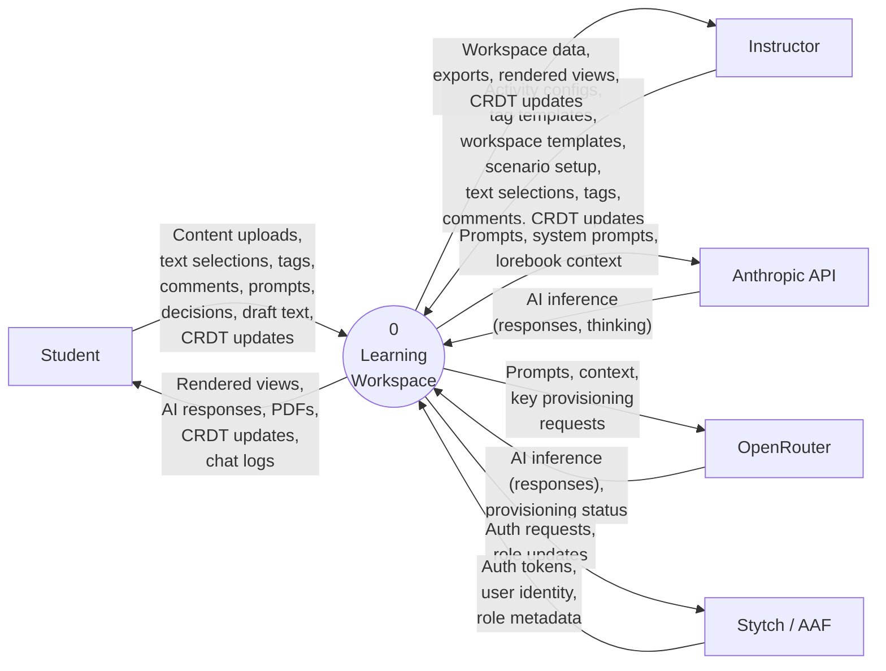

# Context Diagram (Level 0)

> System boundary: Learning Workspace

Last verified: 2026-03-08

## Diagram

## External Entities

| Entity | Description | Inputs to System | Outputs from System |
|--------|-------------|-----------------|---------------------|
| Student | University students using the system for learning activities | Content uploads (HTML, text, files), text selections, tags, comments, prompts, decisions, draft text, CRDT updates, character card imports | Rendered annotation views, AI responses, PDFs, CRDT updates, chat logs |
| Instructor | Teaching staff who configure activities and review student work | Activity configs (units, weeks, activities), tag templates, workspace templates (including tags, tag sets, respond-tab template, documents), scenario setup (roleplay characters, wargame configs), text selections, tags, comments, CRDT updates | Workspace data (student work visibility + own work), exports, rendered views, CRDT updates |
| Anthropic API | Claude model inference for roleplay and wargame | AI inference responses, extended thinking content | Prompts, system prompts, lorebook context |
| OpenRouter | LLM inference and token management for the LLM playground | AI inference responses, provisioning status | Prompts, context, API key/token provisioning requests |
| Stytch / AAF | Authentication and identity provider (B2B, AAF OIDC, Google OAuth, GitHub OAuth, magic links) | Auth tokens, user identity, role metadata (eduperson_affiliation) | Auth requests, role updates |

## System Boundary

**In scope:** Web application serving annotation workspaces, AI roleplay sessions, wargame simulations, LLM playground conversations, PDF export, real-time CRDT collaboration, course/activity management, access control.

**Out of scope:** Learning Management Systems (students manually transfer PDFs), SillyTavern (character cards imported as files, no live integration), university student management systems (enrollment is manual).

## Design Decisions

- **Student and Instructor share annotation flows.** Both actors send the same data types (selections, tags, comments, CRDT updates) to the annotation process. Permission level (owner, editor, viewer, peer) determines capability, not separate data flows.
- **Collaborators are not a separate entity.** Real-time collaboration (CRDT sync, cursor positions) flows through the same Student/Instructor entities. A "collaborator" is another user in a different browser session, not a distinct external actor.
- **OpenRouter includes management API.** Beyond inference, the system makes management calls to OpenRouter for per-student token/key allocation.
- **CMS is outside the boundary.** PDFs terminate at the Student/Instructor entity. Students manually upload to their institution's CMS.

## Cross-References

- **Parent:** None (this is the top-level diagram)
- **Children:** [1-level-1-decomposition.md](1-level-1-decomposition.md)
- **Related issues:** —
