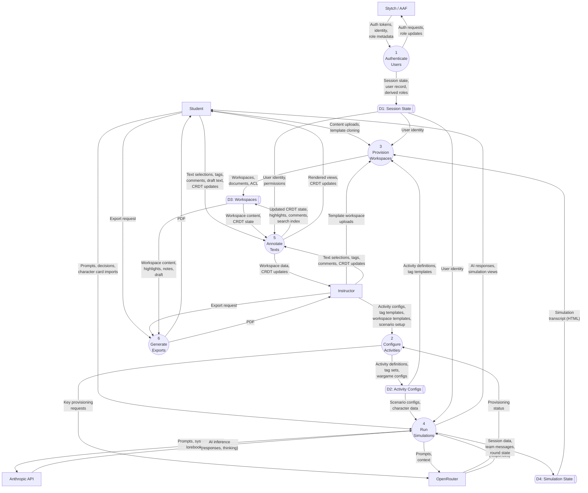

# [1] Learning Workspace — Level 1 Decomposition

> Decomposes process 0 from [0-context-diagram.md](0-context-diagram.md)

Last verified: 2026-03-08

## Diagram

> **Note:** `@{ shape: das }` requires Mermaid v11.3.0+. If your renderer is older, use `[(D1: Session State)]` as a fallback for data store shapes.

## Processes

| Process | Number | Description | Decomposed in |
|---------|--------|-------------|---------------|
| Authenticate Users | 1 | Transforms auth tokens and identity metadata into session state, user records, and derived roles (AAF eduperson_affiliation → instructor/student). Handles magic links, passkeys, OAuth, SSO. | Leaf process |
| Configure Activities | 2 | Transforms instructor intent into activity definitions: units, weeks, activities (annotation or wargame type), tag templates, workspace templates, wargame scenario configs, OpenRouter token provisioning. | Leaf process |
| Provision Workspaces | 3 | Creates workspaces from multiple sources: student content uploads (HTML, text, files via input pipeline), template cloning (from activity definitions), and simulation transcript export (HTML from roleplay/wargame). Includes document processing, tag creation, and ACL grants. | Leaf process |
| Run Simulations | 4 | Manages interactive sessions with LLM providers: roleplay (Anthropic — character cards, lorebook activation, trust mechanics), wargame (Anthropic — team turns, round management, facilitator review), LLM playground (OpenRouter — general-purpose chat). Produces transcripts that feed into Provision Workspaces. | [4-run-simulations.md](4-run-simulations.md) |
| Annotate Texts | 5 | The CRDT-powered annotation engine. Students and instructors highlight text, apply tags, write comments, organise highlights by tag, draft responses. Real-time collaboration via pycrdt. Permission level (owner/editor/viewer/peer) determines read/write capability — viewing is a read-only CRDT session through the same process. | [5-annotate-texts.md](5-annotate-texts.md) |
| Generate Exports | 6 | Transforms annotated workspace state into PDF artefacts for external delivery. Computes highlight regions, runs Pandoc HTML→LaTeX conversion, applies Lua filters for highlight/annotation macros, compiles with LuaLaTeX. External delivery only — internal format conversions (e.g. simulation transcript → workspace) are handled by Provision Workspaces. | [6-generate-exports.md](6-generate-exports.md) |

## Data Stores

| Store | Description | Read by | Written by |
|-------|-------------|---------|------------|
| D1: Session State | Auth sessions (tokens, WebSocket bindings), user records, derived roles, course enrollments. Ephemeral session data (NiceGUI `app.storage.user`) plus persistent user/enrollment records in PostgreSQL. | All processes (identity + permissions) | P1 Authenticate Users |
| D2: Activity Configs | Course/week/activity hierarchy, tag templates, wargame configs (system prompts, scenario bootstraps, timer settings), OpenRouter provisioning state. Persistent in PostgreSQL. | P3 Provision, P4 Run Sims, P5 Annotate | P2 Configure Activities |
| D3: Workspaces | Workspaces, workspace documents (HTML content), persisted CRDT state (binary), ACL entries, search index (materialised FTS). The central data store connecting provisioning, annotation, and export. Persistent in PostgreSQL. | P5 Annotate, P6 Exports | P3 Provision, P5 Annotate |
| D4: Simulation State | Roleplay sessions (in-memory Turn lists, JSONL logs), wargame teams/messages/rounds (PostgreSQL). In-memory state for active roleplay; persistent state for wargame (which survives across sessions). | P4 Run Sims, P3 Provision (export) | P4 Run Simulations |

## Inputs and Outputs

### Boundary Flows (balancing with Level 0)

| Level 0 Flow | Direction | Level 1 Process | Notes |
|-------------|-----------|----------------|-------|
| Content uploads, text selections, tags, comments, prompts, decisions, draft text, CRDT updates | Student → System | P3 (uploads, cloning), P4 (prompts, decisions), P5 (selections, tags, comments, draft, CRDT) | Student input distributed across three processes by type |
| Rendered views, AI responses, PDFs, CRDT updates, chat logs | System → Student | P4 (AI responses, simulation views), P5 (rendered views, CRDT updates), P6 (PDFs) | Student output from three processes |
| Activity configs, tag templates, workspace templates, scenario setup, selections, tags, comments, CRDT updates | Instructor → System | P2 (configs, templates, scenarios), P3 (template uploads), P5 (selections, tags, comments, CRDT) | Instructor input distributed across three processes |
| Workspace data, exports, rendered views, CRDT updates | System → Instructor | P5 (workspace data, rendered views, CRDT), P6 (PDFs) | Instructor views student work through P5 |
| Prompts, system prompts, lorebook context | System → Anthropic | P4 Run Simulations | Roleplay and wargame |
| AI inference (responses, thinking) | Anthropic → System | P4 Run Simulations | |
| Prompts, context, key provisioning requests | System → OpenRouter | P4 (inference), P2 (provisioning) | Two processes talk to OpenRouter |
| AI inference (responses), provisioning status | OpenRouter → System | P4 (inference), P2 (provisioning) | |
| Auth requests, role updates | System → Stytch | P1 Authenticate Users | |
| Auth tokens, identity, role metadata | Stytch → System | P1 Authenticate Users | |

All Level 0 flows accounted for. No orphan flows introduced at Level 1.

### Key Internal Flows

| From | To | Data | Notes |
|------|----|------|-------|
| P4 Run Simulations → D4 | D4 → P3 Provision | Simulation transcript (HTML) | Simulation export path: P4 writes session/transcript to D4, P3 reads and creates workspace in D3 |
| P2 Configure → D2 | D2 → P3 Provision | Activity definitions, tag templates | Provisioning reads activity config to know what to clone |
| P2 Configure → D2 | D2 → P4 Run Sims | Scenario configs, character data | Simulations read wargame/roleplay config |
| P3 Provision → D3 | D3 → P5 Annotate | Workspace + documents | The primary data pipeline: provision creates, annotate consumes |
| P5 Annotate → D3 | D3 → P6 Export | Annotated workspace state | Export reads the final annotated state |
| P1 Auth → D1 | D1 → all | Session identity, permissions | Cross-cutting: every process checks identity |

## Cross-References

- **Parent:** [0-context-diagram.md](0-context-diagram.md)
- **Children:** [4-run-simulations.md](4-run-simulations.md), [5-annotate-texts.md](5-annotate-texts.md), [6-generate-exports.md](6-generate-exports.md)
- **Related docs:** [../../database.md](../../database.md) (schema for D1–D4)
- **Related issues:** —

## Numbering

DFD numbers are stable identifiers. Once assigned, a process keeps its number. New processes get the next available number at this level. Gaps are acceptable.
