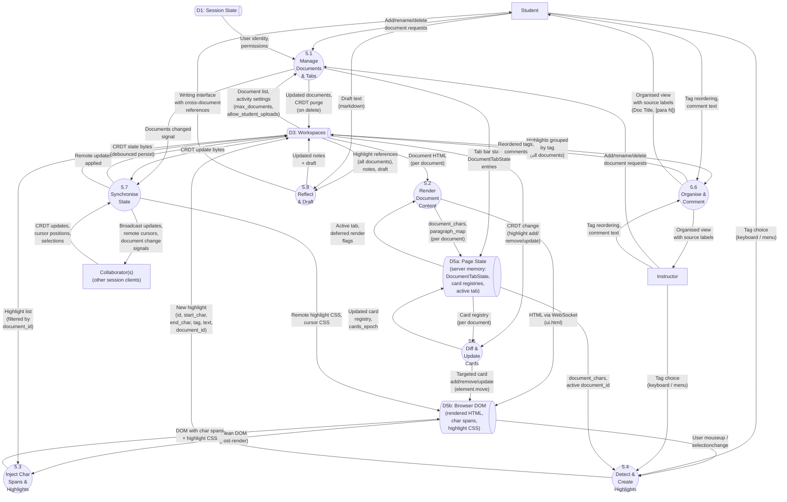

# [5] Annotate Texts — Level 2 Decomposition

> Decomposes Process 5 from [1-level-1-decomposition.md](1-level-1-decomposition.md)

Last verified: 2026-03-14

## Diagram

> **Note:** `@{ shape: das }` requires Mermaid v11.3.0+. If your renderer is older, use `[(D5a: Page State)]` as a fallback for data store shapes.

## Processes

| Process | Number | Description |
|---------|--------|-------------|
| Manage Documents & Tabs | 5.1 | Handles document lifecycle (add, rename, reorder, delete) and tab bar construction. Respects activity-level limits (`max_documents`, `allow_student_uploads`). On delete, purges the document's highlights from CRDT via `remove_highlights_for_document()`. Broadcasts "documents changed" signal to P5.7 for cross-client tab sync. |
| Render Document Content | 5.2 | Deferred per-tab rendering. On first tab visit, reads document HTML from D3, serves to browser via WebSocket, extracts `document_chars` and `paragraph_map` into Page State. Document content is immutable after upload — rendered once, persists in DOM (all-in-DOM with keep-alive). |
| Inject Char Spans & Highlights | 5.3 | Client-side JavaScript walks DOM, wraps each text character in ``. Server computes highlight CSS rules targeting `data-char-index` selectors, filtered by active `document_id`. The char-span injection is the foundation for both highlight rendering and selection detection. |
| Detect & Create Highlights | 5.4 | Captures browser `selectionchange`/`mouseup` events, maps to char indices via char spans, combines with user's tag choice. Creates highlight in CRDT with `document_id` from the active source tab. |
| Diff & Update Cards | 5.5 | On CRDT change, compares current highlights (for affected document) against the card registry (`dict[highlight_id, ui.element]`). Applies targeted add/remove/update — no `container.clear()` or `@ui.refreshable`. Uses `element.move(target_index=N)` for positional insertion sorted by `start_char`. Increments per-document `cards_epoch` for E2E test synchronisation. |
| Organise & Comment | 5.6 | Aggregates highlights from all documents, grouped by tag. Each tile shows "Document Title, [para N]" source label. Drag-and-drop reordering via SortableJS. Comments added per-highlight. "Locate in document" switches to the correct source tab and scrolls via `_warp_to_highlight()`. |
| Synchronise State | 5.7 | CRDT broadcast/apply via pycrdt. Remote cursor and selection rendering via CSS targeting char spans. Debounced persistence (5s) to PostgreSQL. Carries "documents changed" signals from P5.1 for cross-client tab bar sync — this signal rebuilds the tab bar only, does NOT trigger card rebuilds or touch annotation containers. |
| Reflect & Draft | 5.8 | Response composition with Milkdown markdown editor. Highlight references from all documents available as insertable snippets. General notes. Milkdown state managed independently — not subject to clear+rebuild on CRDT changes. |

## Data Stores

| Store | Scope | Contents | Persistence |
|-------|-------|----------|-------------|
| D1: Session State | Level 1 (shared) | User identity, permissions, derived roles | PostgreSQL + ephemeral session |
| D3: Workspaces | Level 1 (shared) | Workspace documents (HTML), CRDT state (binary), ACL, activity settings (`max_documents`, `allow_student_uploads`), search index | PostgreSQL |
| D5a: Page State | Per-client (server memory) | `DocumentTabState` per document (tab, panel, containers, card registry, rendered flag, `cards_epoch`), active tab, `document_tabs` dict | Ephemeral (per session) |
| D5b: Browser DOM | Per-client (browser) | Rendered HTML with char spans, highlight CSS, remote cursor CSS, annotation cards | Ephemeral (rebuilt on page load) |

## Key Design Decisions

### Diff-based card updates (5.5) instead of `@ui.refreshable`

`@ui.refreshable` rejected due to NiceGUI bugs: multi-session cross-contamination (#2535), memory leaks (#2502), lifecycle ordering (#3392). These multiply in a multi-document, multi-user context. The card registry (`dict[highlight_id, ui.element]`) already exists in the codebase (`state.annotation_cards`) — it is repurposed for targeted updates rather than being rebuilt from scratch each time.

### Document change signals (5.1 → 5.7) do not touch cards

"Documents changed" broadcasts only rebuild the tab bar (≤8 lightweight elements). They are a separate DOM subtree from card containers. This avoids the race condition class documented in `_RemotePresence.on_peer_left` where full rebuilds destroy in-flight user interactions.

### All-in-DOM with deferred rendering

Each source tab renders on first visit and persists in DOM thereafter (Quasar keep-alive). Tab switching is CSS visibility only. A 240-page document has been tested and works in the single-document case. Multi-doc multiplies DOM but does not change per-document characteristics. Measure after implementation; refactor to active-tab-only if needed.

### DB is source of truth for document list

The CRDT handles annotation state (highlights, tags, comments). The document list (add, rename, reorder, delete) is a DB operation. No CRDT mirror — avoids sync obligation and DB/CRDT drift. Cross-client sync via lightweight broadcast through existing `_RemotePresence` channel.

## Balancing Verification

### Level 1 ↔ Level 2 (Process 5)

| Level 1 Flow | Level 2 Mapping |
|-------------|-----------------|
| Student → P5 (text selections, tags, comments, draft text, CRDT updates) | Student → P5.4 (selections, tags), Student → P5.6 (comments, reordering), Student → P5.8 (draft text), Student → P5.1 (document management) |
| Instructor → P5 (text selections, tags, comments, CRDT updates) | Instructor → P5.4 (selections, tags), Instructor → P5.6 (comments), Instructor → P5.1 (document management) |
| D3 → P5 (workspace content, CRDT state) | D3 → P5.2 (document HTML), D3 → P5.3 (highlight list), D3 → P5.5 (CRDT changes), D3 → P5.6 (highlights by tag), D3 → P5.7 (CRDT bytes), D3 → P5.8 (references, notes, draft), D3 → P5.1 (document list, activity settings) |
| P5 → D3 (updated CRDT state, highlights, comments, search index) | P5.4 → D3 (new highlights), P5.6 → D3 (reordered tags, comments), P5.7 → D3 (persisted CRDT), P5.8 → D3 (notes, draft), P5.1 → D3 (document changes, CRDT purge) |
| P5 → Student (rendered views, CRDT updates) | P5.2 → D5b → Student (document rendering), P5.5 → D5b (card updates), P5.6 → Student (organised view), P5.8 → Student (writing interface) |
| P5 → Instructor (workspace data, CRDT updates) | Same paths as Student, filtered by permission level |
| D1 → P5 (user identity, permissions) | D1 → P5.1 (upload permission checks), D1 → P5.4 (highlight authorship) |

All Level 1 flows accounted for. No orphan flows introduced at Level 2.

## Cross-References

- **Parent:** [1-level-1-decomposition.md](1-level-1-decomposition.md) — Process 5
- **Supersedes:** `docs/dfd-annotation-pipeline.md` (deleted) — earlier Level 2 written for NiceGUI 3.7.x JS dependency analysis with flat numbering (P1–P6). JS dependency detail folded into Process 5.3 description.
- **Design plan:** [../../design-plans/2026-03-14-multi-doc-tabs-186.md](../../design-plans/2026-03-14-multi-doc-tabs-186.md) — multi-document tabbed workspace
- **Related docs:** [../../annotation-architecture.md](../../annotation-architecture.md) — annotation page package structure

## Numbering

DFD numbers are stable identifiers. Processes are numbered 5.1–5.8 under parent Process 5. Once assigned, a process keeps its number. New processes get the next available number. Gaps are acceptable.
