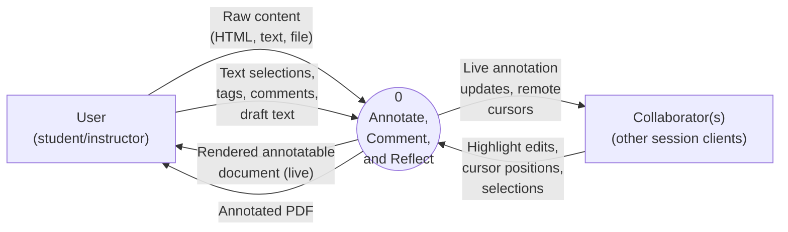
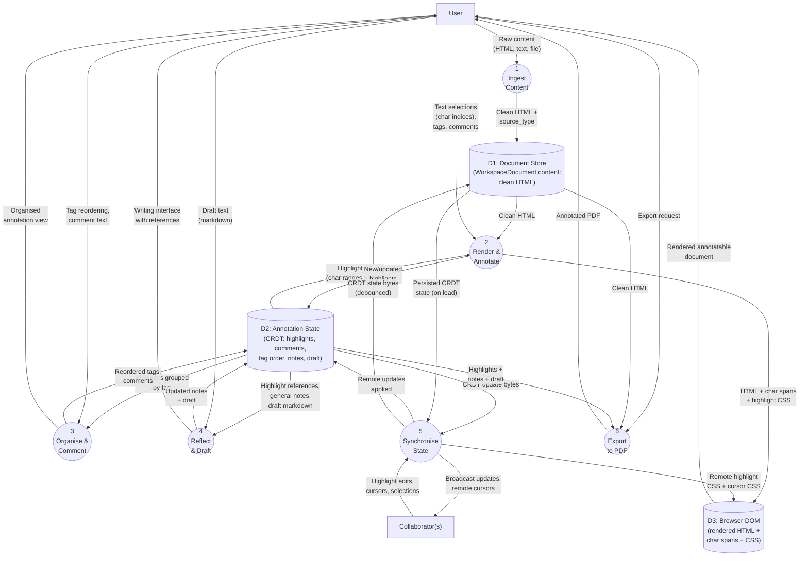
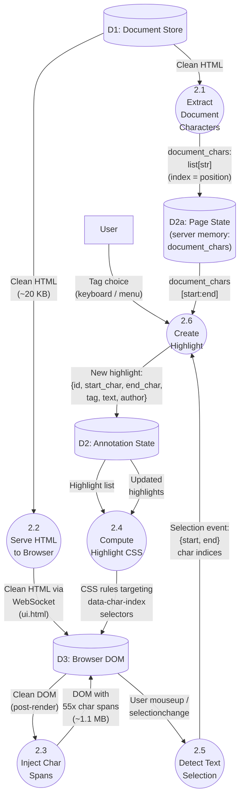
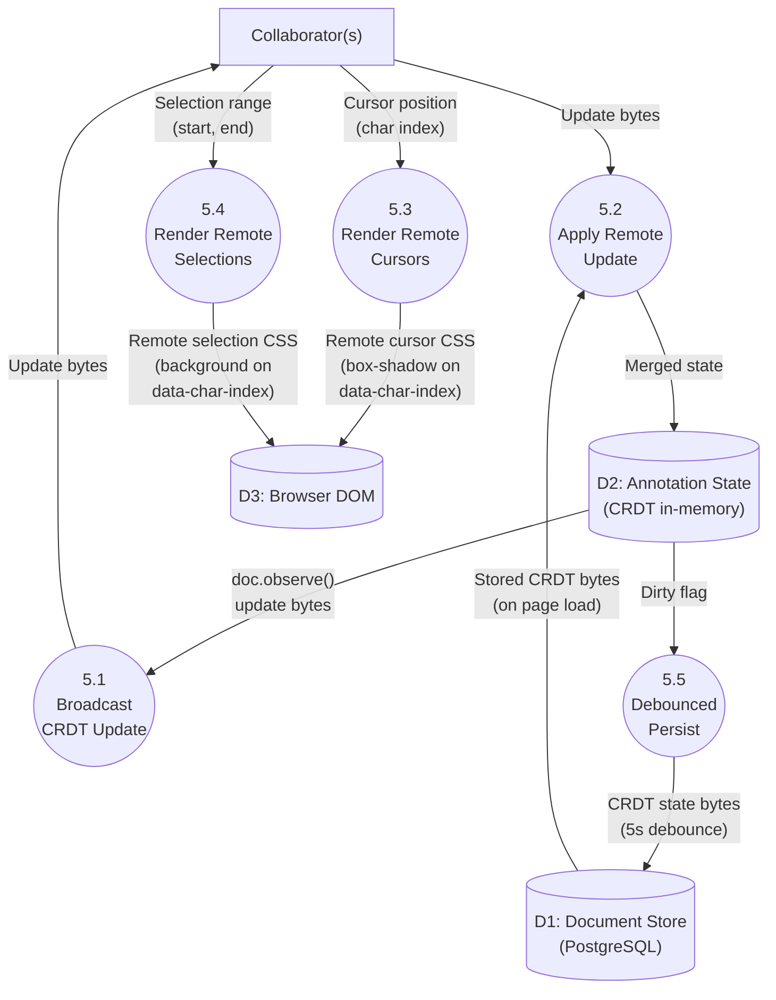
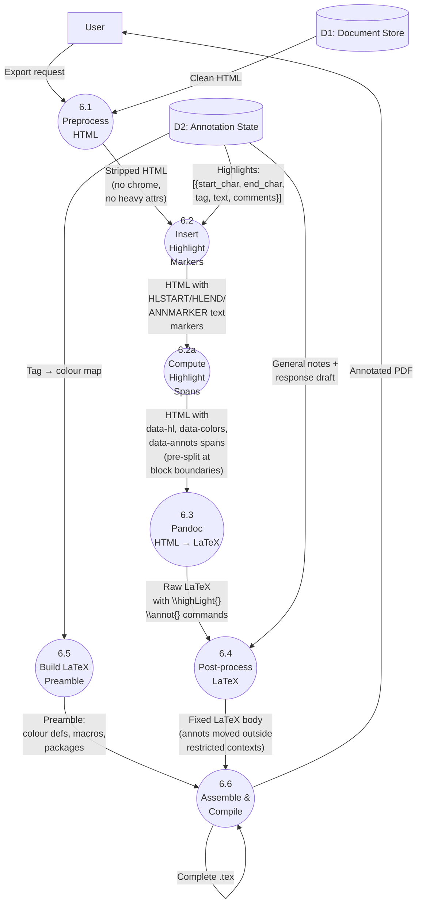

# Data Flow Diagram: Annotation Pipeline (Status Quo)

> **Purpose:** Document the current data flows in the annotation-to-PDF pipeline
> to identify where the system depends on client-side JavaScript and DOM manipulation,
> in preparation for migrating to a NiceGUI backend-heavy rendering approach.
>
> **Methodology:** Yourdon-DeMarco DFD notation. Atemporal (shows data movement,
> not sequence). Functional decomposition from Level 0 context diagram through
> Level 2 detail on JS-dependent processes.
>
> **Notation (Mermaid conventions):**
> - `(( ))` circles = Processes (numbered hierarchically)
> - `[ ]` rectangles = External Entities
> - `[( )]` cylinders = Data Stores
> - Arrows = Data Flows (labelled with data package name)
>
> **Date:** 2026-02-11
>
> **Trigger:** NiceGUI 3.7.x [destroys client-side DOM modifications](https://github.com/zauberzeug/nicegui/issues/5749#issuecomment-3879588127).
> Maintainer confirms this is by design: "NiceGUI is frontend-light backend-heavy,
> maintaining frontend behaviour to facilitate client-side DOM modifications
> frankly isn't top priority."

---

## Level 0: Context Diagram

The entire system as a single process. Shows what crosses the system boundary.

**System boundary includes:** NiceGUI server, browser client, PostgreSQL, Pandoc, LuaLaTeX.
Pandoc and LuaLaTeX are *internal* tools, not external entities — the user never interacts with them directly.

---

## Level 1: Major Functional Areas

Decomposes Process 0 into six sub-processes. Balanced against Level 0: all inputs/outputs of Process 0 are preserved.

### Process Descriptions (Level 1)

| # | Process | Tab | Summary |
|---|---------|-----|---------|
| 1 | Ingest Content | — | Detect content type, clean HTML (strip chrome, attrs, empties), store |
| 2 | Render & Annotate | Annotate | Serve HTML, inject char spans (JS), apply highlight CSS, capture selections |
| 3 | Organise & Comment | Organise | Group highlights by tag, reorder, add comments, cross-reference |
| 4 | Reflect & Draft | Respond | Write response with highlight references, general notes |
| 5 | Synchronise State | — | CRDT broadcast, remote cursors/selections, debounced DB persistence |
| 6 | Export to PDF | — | Compute highlight regions, Pandoc HTML→LaTeX, Lua filter, LuaLaTeX compile |

### Data Store Descriptions

| Store | Technology | Contents | Persistence |
|-------|-----------|----------|-------------|
| D1: Document Store | PostgreSQL `WorkspaceDocument` | Clean HTML, source_type, title | Durable |
| D2: Annotation State | pycrdt `Doc` (in-memory) + PostgreSQL `Workspace.crdt_state` (serialised) | Highlights, comments, tag order, general notes, response draft | In-memory + debounced persist |
| D3: Browser DOM | Browser `#doc-container` | Rendered HTML with `` wrappers + CSS | Ephemeral (rebuilt on page load) |

---

## Level 2: Process 2 — Render & Annotate

This is the **JS-dependent core** that the NiceGUI 3.7.x breakage affects. Decomposed to show exactly where client-side JavaScript is load-bearing.

### Where JavaScript Lives (Process 2)

| Sub-process | Runs on | JS-dependent? | What JS does |
|-------------|---------|---------------|--------------|
| 2.1 Extract Chars | Server (Python) | No | — |
| 2.2 Serve HTML | Server (NiceGUI) | No | — |
| **2.3 Inject Char Spans** | **Browser (JS)** | **Yes** | Walks DOM, wraps each text character in ``. 55x HTML expansion. |
| **2.4 Compute Highlight CSS** | **Server → Browser** | **Partial** | Server computes CSS rules like `[data-char-index="42"] { background: #ff0 }`. Rules depend on char spans existing in DOM. |
| **2.5 Detect Text Selection** | **Browser (JS)** | **Yes** | Listens to `selectionchange`/`mouseup`, finds intersecting char spans, emits `{start, end}` indices to server. |
| 2.6 Create Highlight | Server (Python) | No | — |

**Processes 2.3, 2.4, and 2.5 form the JS-dependent triad.** The char-span injection (2.3) is the foundation: both highlight rendering (2.4) and selection detection (2.5) depend on `data-char-index` attributes being present in the DOM.

---

## Level 2: Process 5 — Synchronise State

Decomposed to show how CRDT state moves between clients and persistence.

### JS Dependencies in Process 5

| Sub-process | JS-dependent? | Why |
|-------------|---------------|-----|
| 5.1 Broadcast | No | Server-side pycrdt observer |
| 5.2 Apply Remote | No | Server-side pycrdt merge |
| **5.3 Remote Cursors** | **Yes** | CSS targets `[data-char-index="N"]` — requires char spans in DOM |
| **5.4 Remote Selections** | **Yes** | CSS targets `[data-char-index="N"]` range — requires char spans in DOM |
| 5.5 Debounced Persist | No | Server-side async save |

---

## Level 2: Process 6 — Export to PDF

Decomposed to show the data transformation chain. This process is **server-side only** — no JS dependency — but it must maintain character index parity with the browser's char-span injection.

### Character Index Parity Requirement

Process 6.2 (Insert Highlight Markers) uses character indices from D2 (Annotation State). These indices were created by Process 2.5 (Detect Text Selection) in the browser, which counts characters based on the char-span DOM.

**The export pipeline reimplements the same character extraction algorithm server-side** (`extract_text_from_html()`) to find byte offsets in the HTML. Both implementations must agree on:

- Whitespace-only text nodes in block containers → skip
- Whitespace runs (including `\u00a0`) → collapse to single space
- ` ` → newline (counts as 1 character)
- `<script>`, `<style>`, `<noscript>`, `<template>` → skip entirely

If the algorithms diverge, highlights appear at wrong positions in the PDF.

---

## JS Dependency Summary

All processes that depend on client-side JavaScript or the char-span DOM:

| Process | Dependency | What Breaks Without It |
|---------|-----------|----------------------|
| **2.3 Inject Char Spans** | JS DOM manipulation | No character-level addressing at all |
| **2.4 Compute Highlight CSS** | CSS `[data-char-index]` selectors | Highlights not visible |
| **2.5 Detect Text Selection** | JS `selectionchange` + char span lookup | Cannot determine which characters were selected |
| **5.3 Remote Cursors** | CSS `[data-char-index]` selectors | Remote cursors not visible |
| **5.4 Remote Selections** | CSS `[data-char-index]` selectors | Remote selections not visible |
| **6.2 Insert Highlight Markers** | Parity with JS char extraction | Highlights at wrong positions in PDF |

### The Core Problem

The char-span injection (Process 2.3) is the **single point of fragility**. It:

1. **Modifies the DOM client-side** — which NiceGUI 3.7.x actively destroys on server updates
2. **Expands HTML 55x** — must happen client-side to avoid WebSocket limits
3. **Creates the addressing scheme** that five other processes depend on
4. **Must be reimplemented server-side** for PDF export (character index parity)

The system has two parallel implementations of character indexing:
- **Browser JS** (`window._injectCharSpans()`) — for live annotation
- **Server Python** (`extract_text_from_html()`) — for PDF export

Both must produce identical indices. Any divergence is a bug (cf. Issues #129, #143).

---

## Balancing Verification

### Level 0 ↔ Level 1

| Level 0 Flow | Direction | Level 1 Mapping |
|-------------|-----------|-----------------|
| Raw content | User → P0 | User → P1 (Ingest) |
| Selections, tags, comments | User → P0 | User → P2 (Annotate), P3 (Organise), P4 (Reflect) |
| Rendered document | P0 → User | P2 → D3 → User |
| Annotated PDF | P0 → User | P6 → User |
| Highlight edits, cursors | Collab → P0 | Collab → P5 (Sync) |
| Live updates, cursors | P0 → Collab | P5 → Collab |

All Level 0 flows accounted for. No orphan flows introduced at Level 1.

### Level 1 ↔ Level 2 (Process 2)

| Level 1 Flow | Level 2 Mapping |
|-------------|-----------------|
| D1 → P2 (Clean HTML) | D1 → P2.1 (extract chars) + D1 → P2.2 (serve HTML) |
| D2 → P2 (Highlight list) | D2 → P2.4 (compute CSS) |
| P2 → D3 (HTML + spans + CSS) | P2.2 → D3 + P2.3 → D3 + P2.4 → D3 |
| User → P2 (Selections, tags) | D3 → P2.5 (selection events) + User → P2.6 (tag choice) |
| P2 → D2 (New highlights) | P2.6 → D2 |

Balanced.
