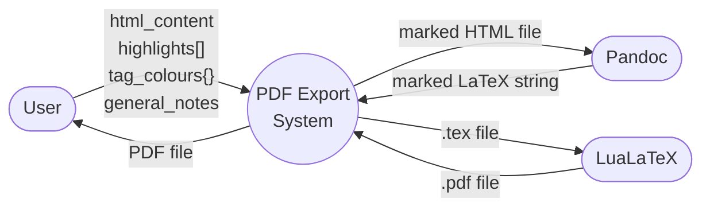
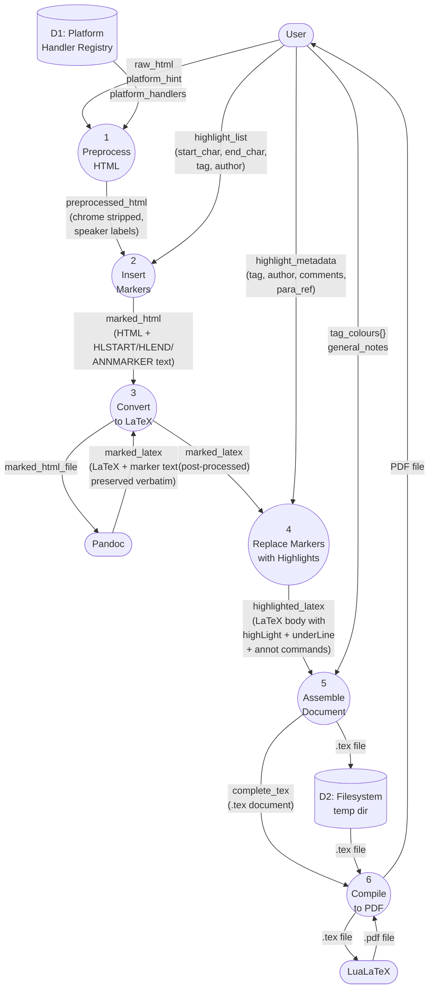
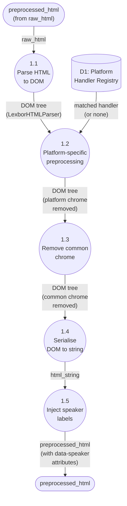
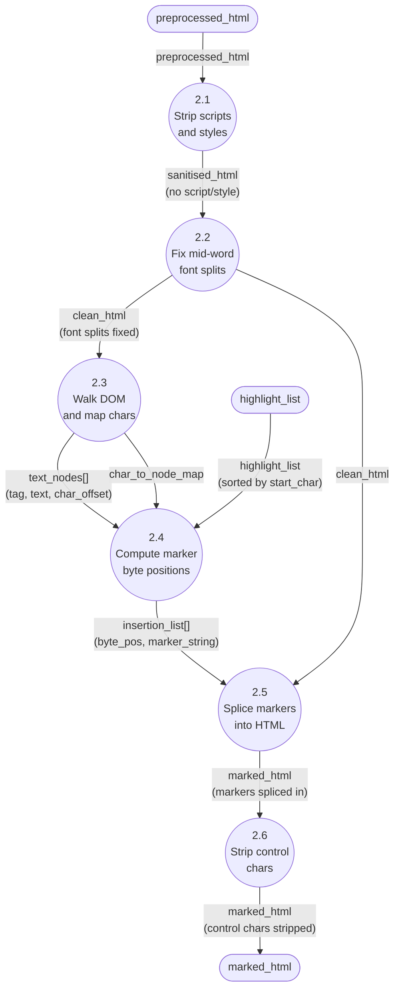
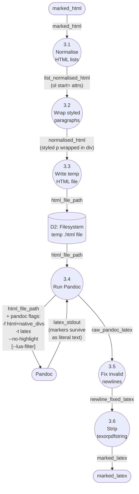
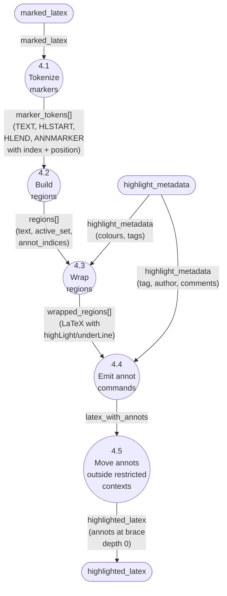
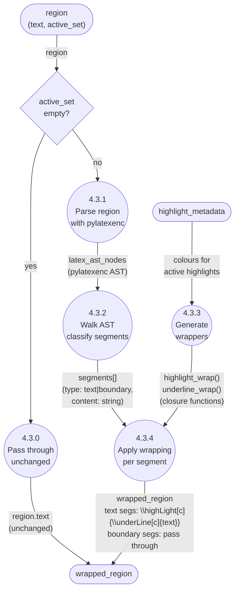
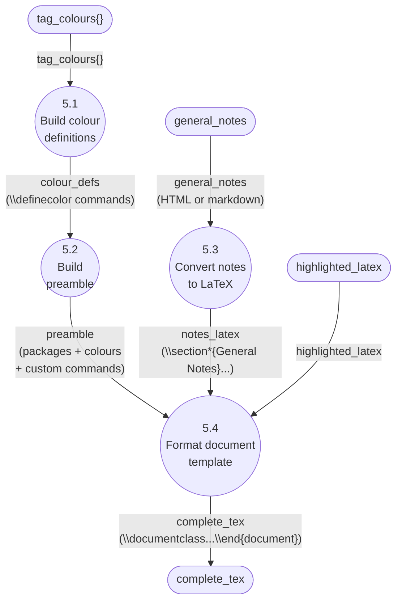
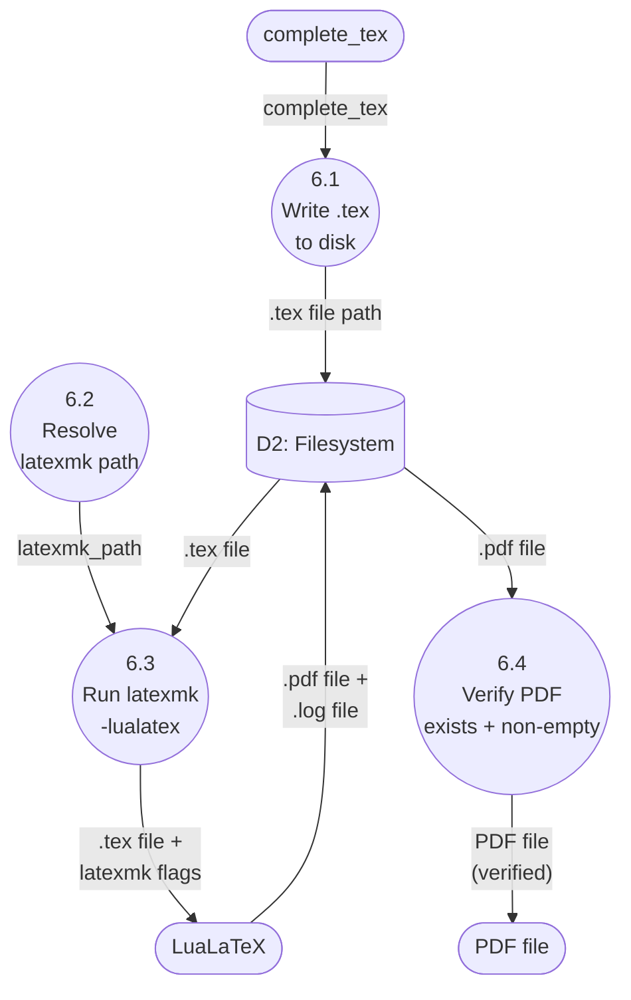

# PDF Export — Data Flow Diagrams

**Date:** 2026-02-09
**Source:** Traced from actual function bodies, not issue descriptions.

## Level 0: Context Diagram

**External entities:**

| Entity | Role |
|--------|------|
| User | Provides document content, highlights, colours, notes. Receives PDF. |
| Pandoc | Converts HTML to LaTeX. Treats markers as opaque text. |
| LuaLaTeX | Compiles .tex to .pdf. lua-ul interprets `\highLight` at node level. |

## Level 1: PDF Export System

**Data dictionary — Level 1 flows:**

| Flow | Content | Format |
|------|---------|--------|
| raw_html | Document content from CRDT doc.content | HTML string (no char spans) |
| highlight_list | User's annotation selections | list[dict] with start_char, end_char, tag |
| highlight_metadata | Per-highlight details for margin notes | tag, author, created_at, comments, para_ref |
| preprocessed_html | Platform chrome stripped, speaker labels injected | HTML string |
| marked_html | HTML with marker sentinels at highlight boundaries | HTML + literal text `HLSTART{n}ENDHL` etc. |
| marked_latex | LaTeX with marker sentinels surviving pandoc | LaTeX string with marker text |
| highlighted_latex | LaTeX body with `\highLight`, `\underLine`, `\annot` | LaTeX string |
| complete_tex | Full `.tex` document with preamble, body, notes | LaTeX document string |
| tag_colours | Mapping of tag names to hex colour codes | dict[str, str] |

---

## Level 2: Process 1 — Preprocess HTML

**Data transforms:**

| Process | Input data | Transform | Output data |
|---------|-----------|-----------|-------------|
| 1.1 | raw_html (string) | selectolax parse | DOM tree (mutable) |
| 1.2 | DOM tree + handler | Handler removes platform-specific elements | DOM tree (modified) |
| 1.3 | DOM tree | Strips buttons, navs, footers | DOM tree (modified) |
| 1.4 | DOM tree | Serialise | html_string |
| 1.5 | html_string | Regex inject `data-speaker` divs | preprocessed_html |

---

## Level 2: Process 2 — Insert Markers

**Data transforms:**

| Process | Input data | Transform | Output data |
|---------|-----------|-----------|-------------|
| 2.1 | preprocessed_html | lxml DOM: remove `<script>`, `<style>`, `<noscript>` | sanitised_html |
| 2.2 | sanitised_html | Regex: merge split font tags at word boundaries | clean_html |
| 2.3 | clean_html | DOM walk matching `extract_text_from_html` logic | text_nodes[], char_to_node_map |
| 2.4 | text_nodes + highlight_list | Map char positions to byte offsets in serialised HTML | insertion_list[(byte_pos, marker_text)] |
| 2.5 | clean_html + insertion_list | String splice back-to-front (preserves offsets) | marked_html |
| 2.6 | marked_html | Strip 0x01-0x1F non-whitespace control chars | marked_html (clean) |

**Marker format:** Literal text strings in the HTML text stream:

- `HLSTART{n}ENDHL` — before first char of highlight n
- `HLEND{n}ENDHL` — after last char of highlight n
- `ANNMARKER{n}ENDMARKER` — after HLEND (annotation placement point)

---

## Level 2: Process 3 — Convert to LaTeX

**Critical data invariant:** Markers (`HLSTART{n}ENDHL` etc.) are plain text characters. Pandoc treats them as document content and preserves them verbatim in the LaTeX output. They appear in the LaTeX text stream alongside the converted content.

**Data transforms:**

| Process | Input data | Transform | Output data |
|---------|-----------|-----------|-------------|
| 3.1 | marked_html | `<li value="N">` to `<ol start="N">` | list_normalised_html |
| 3.2 | list_normalised_html | lxml: wrap `
` in `
` | normalised_html |
| 3.3 | normalised_html | Write to temp file | html_file_path |
| 3.4 | html_file_path | Pandoc subprocess | raw_pandoc_latex |
| 3.5 | raw_pandoc_latex | Fix ` ewline{}` in table contexts | newline_fixed_latex |
| 3.6 | newline_fixed_latex | Strip `\texorpdfstring` for luatexja | marked_latex |

---

## Level 2: Process 4 — Replace Markers with Highlights

This is where the known problem lives. Decomposed in detail.

### Level 3: Process 4.3 — Wrap Regions (the problem area)

**This is the failure point for hl5/hl9.**

The problem: when a region's text spans a structural boundary (e.g. contains a `\section{...}` command), process 4.3.1 must parse that LaTeX correctly and 4.3.2 must identify the boundary so 4.3.4 can close and reopen the highlight wrapping around it.

**Data at each step for a cross-heading region:**

| Step | Data | Example for hl5 |
|------|------|-----------------|
| Input | region.text | `"...end of previous para  \\section{Grounds of Appeal}  Mr Lawlis sought..."` |
| 4.3.1 | pylatexenc AST | Nodes: [chars, group, macro(section), chars, ...] — **UNVERIFIED** |
| 4.3.2 | segments | `[("text", "...end"), ("boundary", "\\section{...}"), ("text", "Mr Lawlis...")]` — **UNVERIFIED** |
| 4.3.4 | wrapped | `\highLight{...end}  \section{Grounds of Appeal}  \highLight{Mr Lawlis...}` — **DESIRED** |

---

## Level 2: Process 5 — Assemble Document

---

## Level 2: Process 6 — Compile to PDF

**Inside LuaLaTeX (opaque to us currently):**

The LuaLaTeX engine processes the .tex internally as:

1. **Macro expansion** — `\highLight[colour]{text}` expands
2. **Node list construction** — text becomes glyph nodes, `\highLight` sets lua-ul attributes
3. **lua-ul callback** (`pre_append_to_vlist_filter`) — scans for attribute boundaries, injects `\leaders\vrule` for backgrounds
4. **Line breaking, page breaking** — standard TeX
5. **PDF output** — rendered pages

We have **no visibility** into steps 1-5 from the Python side. The only feedback is: PDF exists (success) or compilation error in .log (failure).

---

## Summary: Where We Can Read and Write Data

| Point | Can Read? | Can Write/Modify? | Tool |
|-------|-----------|-------------------|------|
| raw_html | Yes | Yes | Python |
| preprocessed_html | Yes | Yes | Python (selectolax) |
| marked_html | Yes | Yes | Python |
| marked_latex (after Pandoc) | Yes | Yes | Python string ops |
| marked_latex (before P4) | Yes | Yes | Python |
| Pandoc conversion | No (black box) | Partially (Lua filters, flags) | Pandoc CLI |
| pylatexenc AST | Yes (read AST) | No (not round-trip safe) | pylatexenc |
| highlighted_latex | Yes | Yes | Python string ops |
| complete_tex | Yes | Yes | Python |
| LuaTeX node list | **Not currently** | **Not currently** | Lua callbacks (potential) |
| PDF output | Yes (file) | No | - |

**Key gap:** We cannot currently observe the LuaTeX node list. Experiment E4 would open this up.
